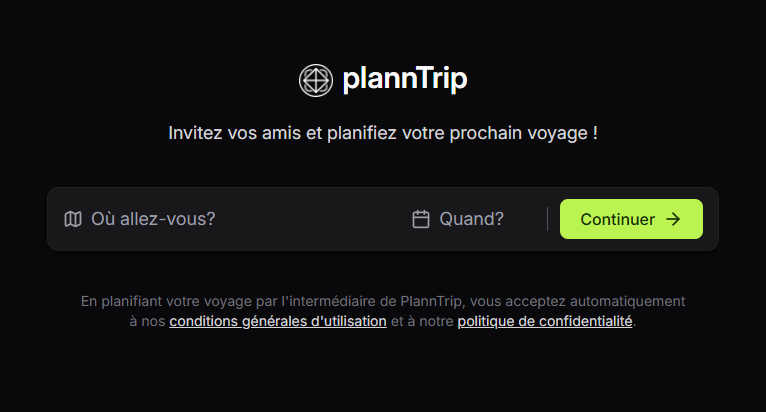

<h1 align="center">Hey  I'm Xenia</h1>

<h3 align="center">💻 Front-end Developer | React.js • Next.js • TypeScript</h3>

🌍 Based in France & open to remote opportunities  
🤝 Open to collaborating on creative, user-focused web projects  

--

### 🎨 My Portfolio  
🔗 <a href="https://xeniadev.netlify.app/" target="_blank">Portfolio</a>

--

### ⚡ Technologies & Tools  

These are the main technologies and tools I work with:

---

### 🧩 Featured Projects  

#### 🧭 PlannTrip  
✈️ A full-stack travel planning web application built with React, TypeScript, Nest.js, Prisma, PostgreSQL, and Docker.
🧠 It allows users to create, manage, and visualize personalized travel itineraries with an intuitive and responsive UI.
 
[GitHub](https://github.com/xeniaalex3/PlannTrip) | [🌐 Live Demo](https://planntrip.netlify.app/)

#### 💬 Feedback Widget  
💡 A real-time feedback component integrated into web apps.
 
[🔗 GitHub](https://github.com/xeniaalex3/Feedback-Widget) | [🌐 Live Demo](https://feedback-widget-xi-snowy.vercel.app/)  

#### 🎮 eSports  
🏆 A responsive platform for discovering and managing game events.
 
[🔗 GitHub](https://github.com/xeniaalex3/eSports) | [🌐 Live Demo](https://e-sports-phi.vercel.app/)  

---

### 📈 GitHub Stats  

---

### 📫 Let's Connect  

