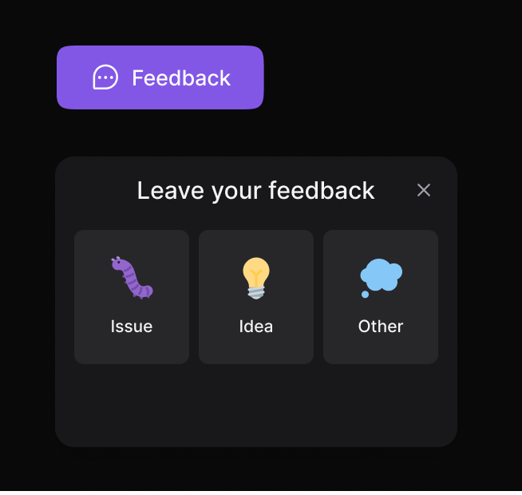

<h1> Hey  I'm Xenia , I'm front-end developer! </h1>

*   🌍  I'm based in France
*   🤝  I'm open to collaborating on interesting projects as a developer

 

  ### 🎨 My Portfolio: 
  
 
  <a href="https://xeniadev.netlify.app/" target="_blank">Website</a>
   
  ## ⚡ Technologies
  
  These are some of the technologies and tools that I work with:

  
   

 ## 🛠️ My Projects

### plannTrip
[GitHub](https://github.com/xeniaalex3/PlannTrip)

</a>

### Feedback Widget 
[GitHub](https://github.com/xeniaalex3/Feedback-Widget) | [Live Demo](https://feedback-widget-xi-snowy.vercel.app/)

### eSports 
[GitHub](https://github.com/xeniaalex3/eSports) | [Live Demo](https://e-sports-phi.vercel.app/)

 

